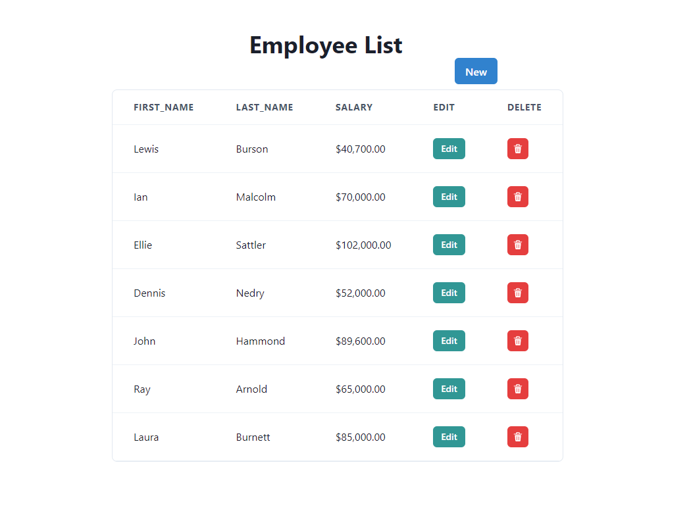
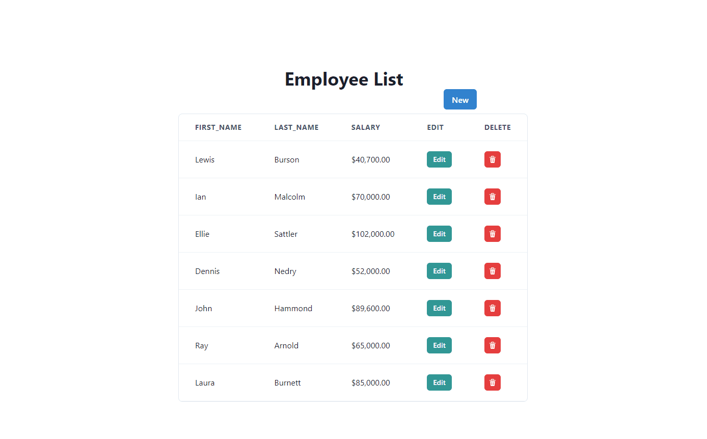
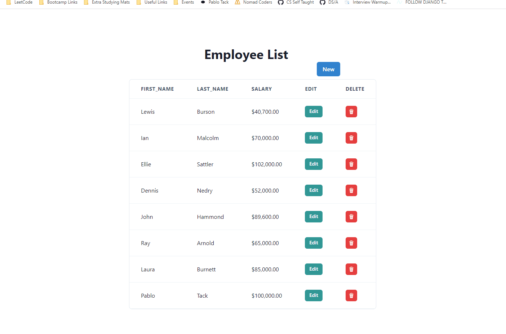
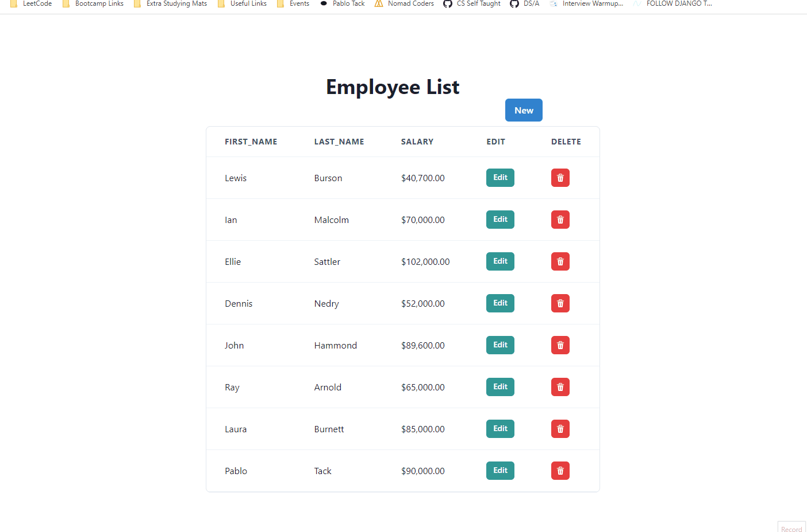

# eCapital Corp Take Home Assignment

Presenting a simple Employee Table "App", it is a full stack application as it is able to do basic CRUD functionalities.

## 🔍 Preview









## 📱 Mobile Considerations

While this app could be fully responsive, taking into the account the information required to be shown, it has a set width which prevents from everything being able to be seen within one small screen. It is scrollable if this is to be used on a mobile device.

## 🚀 Features

-   User is able add new employees.

-   User is able edit employees.

-   User is able delete employees.

-   Salary information is displayed in currency format.

## 🔧 Getting Started

You can clone this repository by using the command line:

```bash

git clone git@github.com:tackpablo/employee-table-app.git

cd backend

npm install

cd ../frontend/

npm install

```

-   Remember to install dependencies after cloning it locally.

-   Please note, to use this application, you will need to install [PostgreSQL](https://www.postgresql.org/download/). Please visit the link for more information and installation. You will need pgAdmin and credentials for the next step.

-   Create an .env file in the backend folder to keep your keys private - Create a copy of the .env.example

    ```
    DB_HOST=HOST_NAME
    DB_USER=USER_NAME
    DB_PASS=DB_PASSWORD
    DB_NAME=DB_NAME
    DB_PORT=DB_PORT (default 5432)
    ```

-   Please visit [pgAdmin's](https://www.pgadmin.org/docs/pgadmin4/development/getting_started.html) getting started guide.

-   Once everything has been installed, please use these commands:

```
backend folder - nodemon
frontend folder - npm run start
```

-   Log into the SQL Shell (provided once PostgreSQL is installed) and copy + paste the dbScript.sh contents to create the appropriate database, table, and seeds.

## 👩‍💻 Technologies and Libraries Used

-   Frontend:

    -   React
    -   ChakraUI Component Library

-   Backend:

    -   Express
    -   Node
    -   PostgreSQL

## 📝 Considerations and Notes

As per the requirements of this assignment, all goals, functional requirements, technical guidelines were met, with the exception of a working SQL script to initialize the database. The queries required for creating the database, the table, and seeds are found in the src/backend/db/dbScripts.sh file.

All components were implemented using the ChakraUI component library. The provided inline styling was used as to prevent having to separate all styles into CSS/SCSS/SASS files.

For usability, the modals revert back to default and the prompt also clears after submission.

Initially, salary information was stored using bigInt over Int numeric type. This was due to a few reasons:

-   simple to use and compatible with every language
-   enough precision to handle franctions of a cent
-   smaller data size for storage over strings and numerics

However, this was changed to Int later as the app was simple enough that the decimal calculations were causing errors in input.

As for the database, ElephantSQL was available as an alternative (among others) for the SQL database. Due to ElephantSQL being hosted on the cloud (AWS EC2 Instance), it was considered a better and safer route to use PostgreSQL.

For the CRUD update request, PUT was used over PATCH. While PATCH is considered the better option (only updates data that changed whereas PUT updates the whole entry), PUT was used to save time with validating update entries.

Initially some states were put at the parent component and drilled down all the way to the child components. There were problems where the context was causing re-rendering, those were fixed and reduced the overall amount of code.

For modularity and reusability, the table was modified to an extent to allow for both. The buttons required for each entry prevents full modularity and reusability, but it can take generic data and produce a table if required. The modals could have also been refactored but due to their location, time required, and complexity they were left as is.

Out of the BREAD functionalities, specific ID was not used. This could have been useful in cases where editing for example, requires specific user information but we had a global store of all employees available (and a very small size of them) so it was easier to filter through them rather than make calls to the database.

One very minor drawback to this project was due to the lack of planning on my part for the branch names and commit naming conventions. More time should have been spent on determining naming conventions for branches and commit messages.
